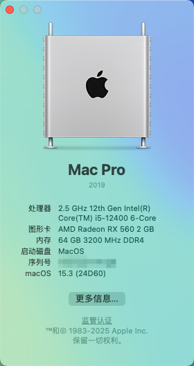

# Vostro 3020 Small Form Factor-Hackintosh-EFI

| Parts    | Name                                                 |
| -------- | ---------------------------------------------------- |
| CPU      | Intel Core i5-12/13400（ UHD730 iGPU not working ） |
| Mobo     | Dell 8VX12 ( OEM, Intel B660 chipset, LGA1700 )      |
| RAM      | DDR4 32Gx2 ( KLEVV KD4BGUA80-32N220D )             |
| Drive    | UNIC UNSPC1T0ALNM                                   |
| GPU      | AMD Radeon RX560 768SP 2GB D5 with 4 mini-DP         |
| Ethernet | Realtek RTL8168H                                     |
| Wi-Fi    | Intel AX210 160MHz                                   |
| Version  | 15.3 (24D60) Sequoia                                 |

## What's working

1. Booting
2. hardware acceleration (requires supported GPUs)
3. Ethernet
4. Wi-Fi (Need some extra step. Read [this guide by randomappleboi](https://github.com/randomappleboi/Native-Wifi-for-Hackintoshes-with-Intel-Wireless-cards-on-macOS-sequoia) )
5. Bluetooth (Intel only, as only IntelBluetoothFirmware.kext and IntelBTPatcher.kext are installed)

## What doesn't work

1. iServices ( Requires a working WiFi & usable S/N)
2. Apple Pay ( contact [tcook@apple.com](mailto://tcook@apple.com) if you can get it to work)
3. hibernation ( Broken due to bluetooth related problems. Causes kernel panik)

## Screenshot

